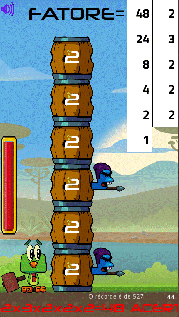

# **Factorizar Tambores**

# Acerca de
> - Este juego 2D es parte de un conjunto experimental de juegos educativos que se construyó usando el Godot engine y usando el lenguaje GDScript (similar a python)
> - Factoriza un número destruyendo barriles.  
> [Basado en el curso de Udemy de Daniel Ciolfi](https://www.udemy.com/share/101H2o3@0zyuHpubHArkGylel-tlkpuc2Z8f7BSf-UPUKMRqKbIxfDej4CiTEewmp7UrDPCV/)
>
>  

# Aspectos
> - El juego consiste en un pájaro con un mazo y una pila de barriles.
> - El pájaro tiene algo de tiempo para resolver la factorización de un número generado aleatoriamente a través de mazos en los barriles.
> - Algunos barriles tienen estampado un número primo que se puede elegir.
> - Un impacto externo (clic) del mazo solo mueve la pila de barriles hacia abajo.
> - El impacto interno (clic) del mazo en el barril numerado transfiere el número primo respectivo para ser un factor de factorización.
> - Puedes colocar el pájaro a la izquierda o derecha de los barriles simplemente haciendo clic en el lado respectivo.
> - Ganas si resuelves la factorización y pierdes si eliges un número equivocado, si te golpea una lanza o si se acaba el tiempo.
> - Cada mazo aumenta el contador de tiempo.
> - La velocidad de descenso de los barriles y el límite superior del número a factorizar varían en seis niveles con dificultades crecientes.
> - Se colocan pequeños barriles en la parte superior del temporizador que indican en qué nivel se encuentra.
> - El sonido se puede apagar haciendo clic en el botón en la esquina superior izquierda de la pantalla.

# diseños
> ## Una página de inicio típica  
> - El número inicial a factorizar se genera aleatoriamente.  
> 

> ## Si aciertas la factorización de 34
> - Para esto golpeas un barril con el número 2 y uno con el número 17.  
> - Ganaste!!!  
> 

> ## Otro ejemplo, ahora aciertas la factorización de 48
> - Para esto golpeas un barril numerado 2 4 veces y un barril numerado 3 una vez.  
> - Ganaste de nuevo!!!  
> 

> ## Que mal, perdiste!!!
> - El número 19 es primo, debe esperar un barril con él estampado.  
> - 19 dividido por 3 no es un número entero.  
> - ¡Buena suerte en el próximo movimiento!  
> 

# Modelos
> - Godot adopta en esencia un diseño orientado a objetos con un sistema flexible de escenas y jerarquías de nodos.
> - Árboles de nodos (nodo: el bloque de construcción más pequeño) que los agrupan en escenas.
> - Los nodos se comunican entre sí a través de señales.
> - Un script en el lenguaje GDScript es una clase que extiende (hereda) una clase de nodo o una nueva clase original.

# Tecnologías
> - Godot engine 2.1.4
>     - http://downloads.tuxfamily.org/godotengine/2.1.4/
> - GDScript (parecido com python)

# Ejecutar el juego
> - Descarga Godot y el juego.
> - Inicie godot e importe el archivo engine.cfg en el directorio raíz del juego.
> - Ejecutar en modo desarrollo o compilar (exportar) para android, ios, windows, linux, etc.

# Autor
> Pedro Vitor Abreu
>
> <soft.pva@gmail.com>
>
> <https://github.com/softpva>