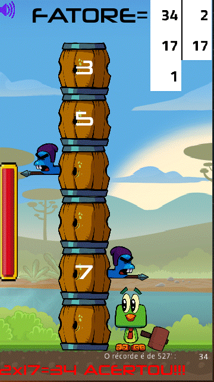

# **Fatorar Tambores**

  

# Sobre
> - Este jogo 2D é parte de um conjunto experimental de jogos educativos que foi construido utilizando-se a Godot engine e usando a linguagem gdscript (parecida com python)
> - Fatorize um número destruindo barris.
> [Baseado no curso da Udemy por Daniel Ciolfi ](https://www.udemy.com/share/101H2o3@0zyuHpubHArkGylel-tlkpuc2Z8f7BSf-UPUKMRqKbIxfDej4CiTEewmp7UrDPCV/)
>
>  

# Aspectos
> - O jogo consiste de um pássaro com uma marreta e uma pilha de barris.
> - O pássaro tem um tempo para resolver a fatoração de um número aleatoriamente gerado através de marretadas nos barris.
> - Alguns barris possuem um número primo estampado que pode ser escolhido.
> - Um impacto (clique) externo da marreta apenas move a pilha de barris para baixo.
> - O impacto interno (clique) da marreta no barril numerado transfere o respectivo número primo para ser um fator da fatoração.
> - Você pode colocar o pássaro à esquerda ou à direita dos barris apenas clicando no respectivo lado.
> - Você vence se resolver a fatoração e perde se escolher um número errado, se for atingido por uma lança ou se o tempo acabar.
> - Cada marretada aumenta o contador de tempo.
> - A velocidade de descida dos barris e o limite superior do número a ser fatorado variam em seis níveis com dificuldades crescentes.
> - Pequenos barris são colocados sobre o temporizador indicando em qual nível você está.
> - O som pode ser desligado clicando no botão que está no canto superior esquerdo da tela.

# Layouts
> ## Uma típica página inicial
> - O número inicial a ser fatorado é gerado aleatoriamente.  
> 

> ## Se você acertar a fatoração de 34
> - Para isto você atingiu um barril com o número 2 e um com o número 17.  
> - Você venceu!!!   
> 

> ## Outro exemplo, agora você acerta a fatoração de 48
> - Para isto você atingiu um barril com o número 2 por 4 vezes e uma vez o barril com o número 3.  
> - Você venceu novamente!!!  
> 

> ## Que pena, você perdeu!!!
> - O número 19 é primo, você deveria esperar um barril com ele estampado.
> - 19 dividido por 3 não é um número inteiro.  
> - Boa sorte na próxima jogada!   
> 

# Modelos
> - Godot adota em seu núcleo um projeto com orientação a objetos com um sistema flexível de cenas e hierarquias em nós.
> - Árvores de nós (nó: o menor bloco de construção) que agrupa-os em cenas.
> - Nós se comunicam entre si através de sinais. 
> - Um script na linguagem GDScript é uma classe que estende (herda) uma classe nó ou uma nova classe original.

# Tecnologias
> - Godot engine 2.1.4
>     - http://downloads.tuxfamily.org/godotengine/2.1.4/
> - GDScript (parecido com python)

# Rodando o jogo
> - Faça o download do godot e do jogo.
> - Inicie o godot e importe o arquivo engine.cfg no diretório raiz do jogo.
> - Rode em modo de desenvolvimento ou compile (exporte) para android, ios, windows, linux, etc.

# Author
> Pedro Vitor Abreu
>
> <soft.pva@gmail.com>
>
> <https://github.com/softpva>

