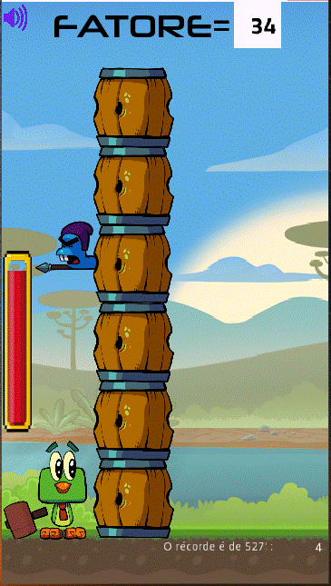
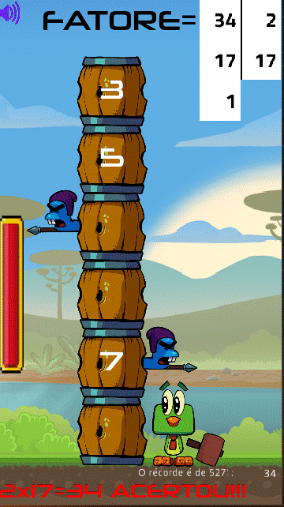
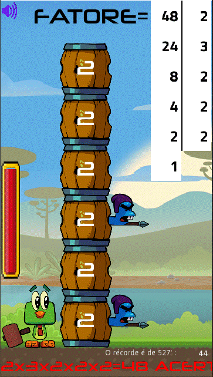
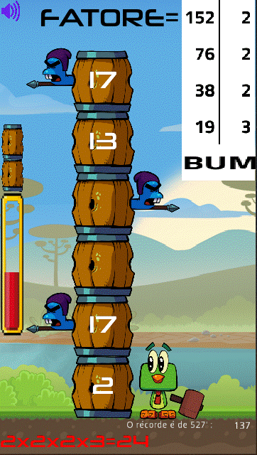

# **Factorize Barrels (Fatorar Tambores)**

  

# About
> This 2D game is part of a experimental set of educational games built in godot engine using gdscript language. (like python)  
> Factorize a number hitting off barrels.   
> [Based on the Udemy course by Daniel Ciolfi ](https://www.udemy.com/share/101H2o3@0zyuHpubHArkGylel-tlkpuc2Z8f7BSf-UPUKMRqKbIxfDej4CiTEewmp7UrDPCV/)
>
>  

# Features
> - The game consists of a bird with a sledgehammer and a stack of barrels.
> - The bird has time to solve a random number to be factored by hitting the barrels.
> - Some barrels contain a prime number stamped in it to be chosen.
> - The external impact of the hammer just moves the pile down.
> - The internal impact (click) of the hammer points the respective prime number to become a factor in the factorization.
> - You can place the bird to the left or right of the barrels just by clicking on the respective side.
> - You win if you solve the factorization and you lose if you miss a number, get hit by a spear or run out of time.
> - Hitting increases the timer counter.
> - The speed at which the barrels fall down and the upper limit of the random number to be factored vary in six levels with increasing difficulties.
> - Small barrels are added above the time counter, showing what level you are at.
> - The sound can be turned off by the button in the upper left corner.

# Layouts
> ## A typical start page  
> - The initial number to be factored is randonomicaly generated.  
> 

> ## If you get right the factorization of 34  
> - For that you hit a barrel with number 2 and number 17  
> - And you won!!!  
> 

> ## Another example, now you get right the factorization of 48  
> - For that you hit a barrel with number 2 for 4 times and number 3 for once.  
> - And you won again!!!  
> 

> ## Oh my god, you lost!!!
> - Number 19 is a prime number, you should expected it to be shown on a barrel.  
> - 19 divided by 3 is not an integer number.  
> - Good look next!   
> 

# Models
> - Godot embraces object-oriented design at its core with its flexible scene system and Node hierarchy.
> - Tree of nodes (node: smallest building blocks) that you group together into scenes. 
> - Nodes communication each other by signals. 
> - A Script in GDScript language is a class that extend (inherit) a node class or you can create a new original one class.

# Tecnologies
> - Godot engine 2.1.4
>     - http://downloads.tuxfamily.org/godotengine/2.1.4/
> - GDScript (like python)

# Kick off
> - Download the engine and the game.
> - Start godot engine and import the engine.cfg in the root directory of the game.
> - Run in dev mode or compile (export) for android, ios, windows, linux, etc.

# Author
> Pedro Vitor Abreu
>
> <soft.pva@gmail.com>
>
> <https://github.com/softpva>
>

